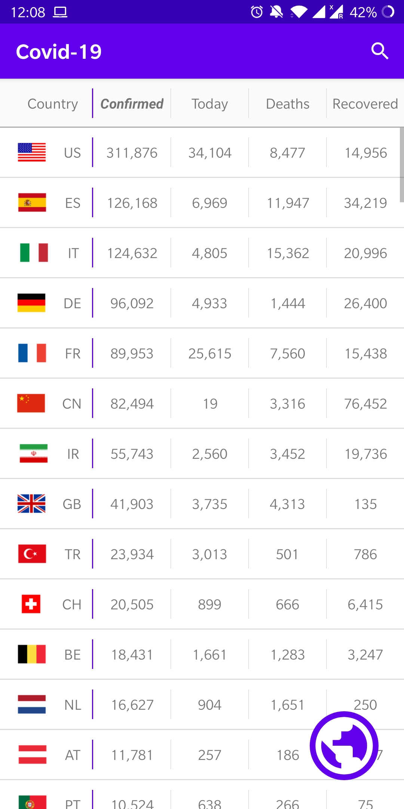
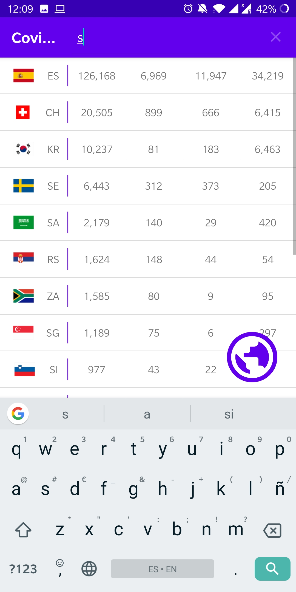
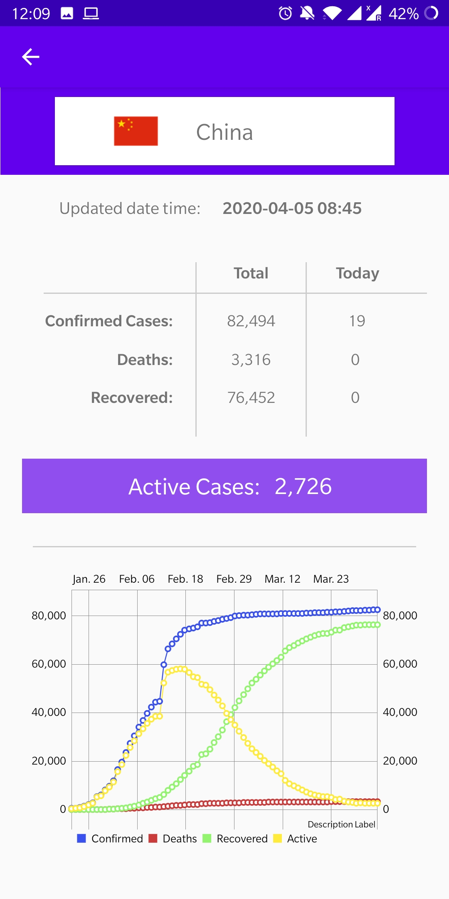
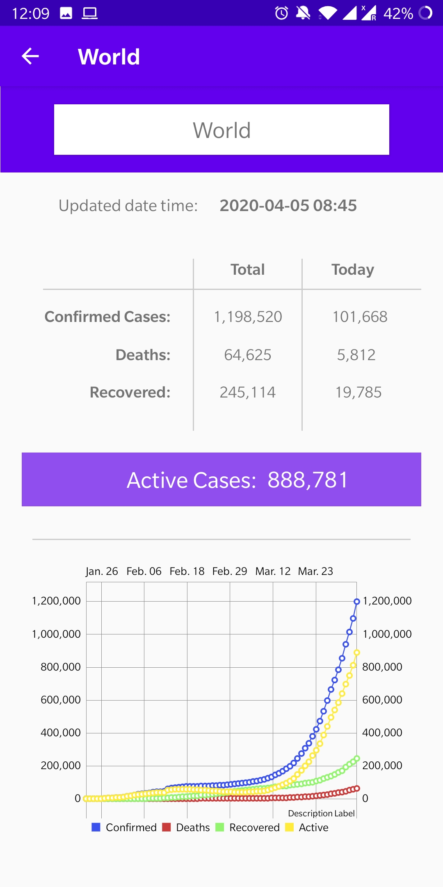

<h1 align="center">Welcome to Coronavirus Mobile App 👋</h1>

  
  

> Android app to be informed about the coronavirus statistics in the world and specific countries

## Data

Api used: [https://developer.smartable.ai/api-details#api=coronavirus&operation=news](https://developer.smartable.ai/api-details#api=coronavirus&operation=news)

## Screeshots

|              Main list Screen              |                   Search                   |             Country statistics             |              World statistics              |
| :----------------------------------------: | :----------------------------------------: | :----------------------------------------: | :----------------------------------------: |
|  |  |  |  |

## Author

👤 **Pablo Ospino**

* Website: https://ospino.me
* Github: [@ospinooo](https://github.com/ospinooo)
* LinkedIn: [@pabloospino](https://linkedin.com/in/pabloospino)

## Show your support

Give a ⭐️ if this project helped you!

***
_This README was generated with ❤️ by [readme-md-generator](https://github.com/kefranabg/readme-md-generator)_
